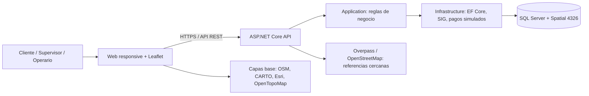
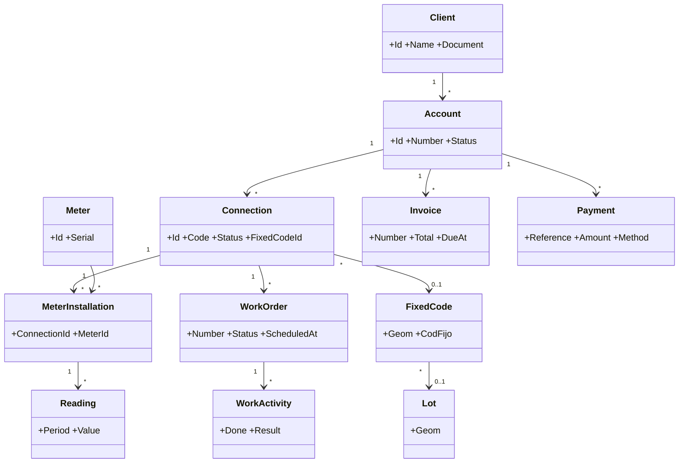
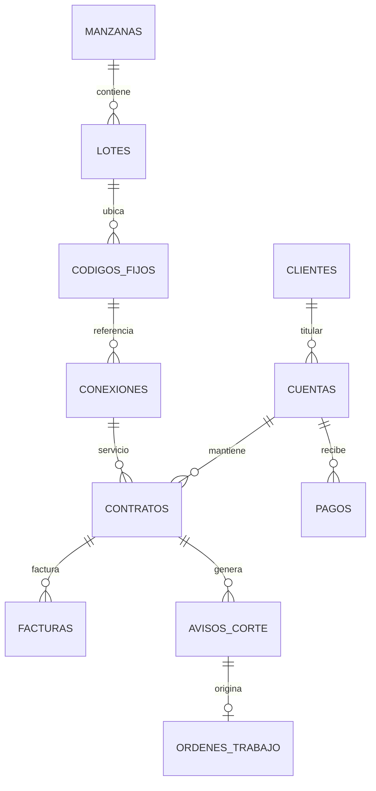

# Arquitectura y diagramas

## Arquitectura de ejecución

La Web solo llama a `/api/geo/places`; AquaControl consulta el servicio de referencias desde el servidor con límites y caché.

## Modelo de clases principal

## Relación espacial y comercial

## Casos de uso prioritarios

- Registrar lectura y generar factura por período.
- Registrar pago simulado y actualizar el saldo.
- Generar aviso de corte y cancelar la orden cuando se confirma el pago.
- Crear, asignar, ejecutar, verificar y cerrar una orden.
- Buscar código, lote, manzana o vía; inspeccionar atributos y ubicar la entidad en el mapa.
