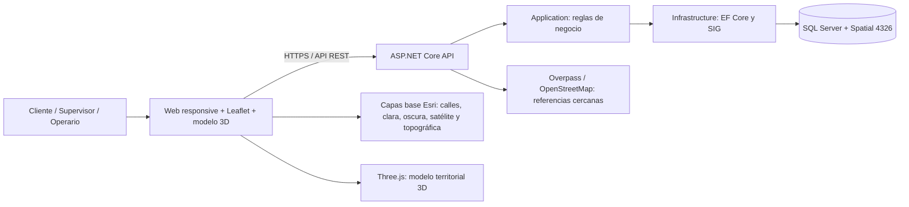
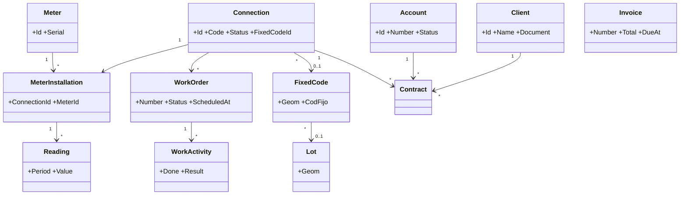
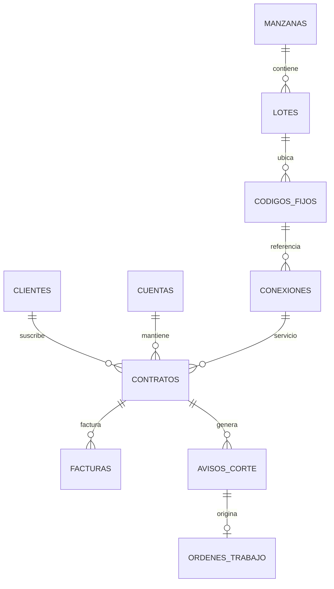

# Arquitectura y diagramas

## Arquitectura de ejecución

La Web solo llama a `/api/geo/places`; AquaControl consulta el servicio de referencias desde el servidor con límites y caché.

## Modelo de clases principal

## Relación espacial y comercial

## Casos de uso prioritarios

Los flujos, actores, reglas y pantallas asociadas se detallan en `docs/07_Casos_Uso_y_Prototipos.md`.

## Estrategia Git

- `main` contiene versiones integradas y verificadas localmente.
- Cada cambio funcional se registra en un commit descriptivo y se publica en `origin/main`.
- Los cambios de base de datos se acompañan con un script SQL idempotente y una verificación de predespliegue.
- Los respaldos y archivos locales de contraseñas están excluidos del control de versiones.
