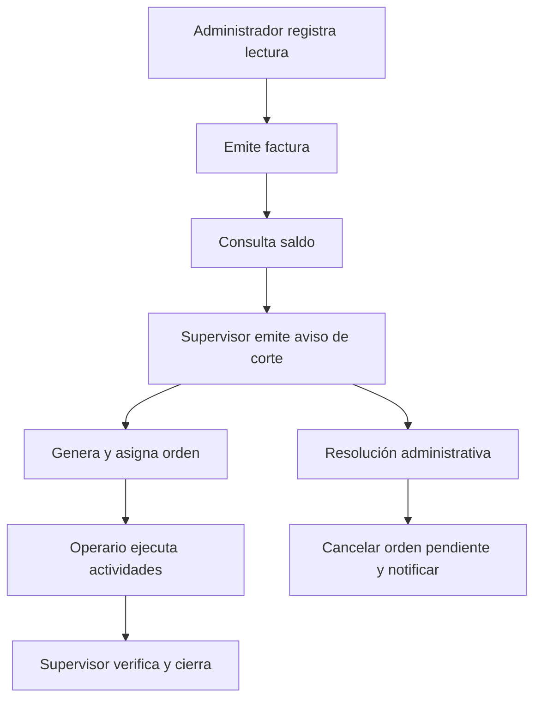
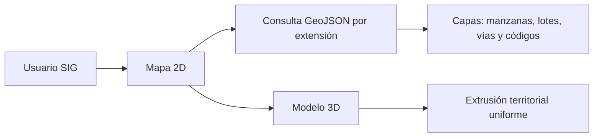

# Casos de uso y prototipos funcionales

## Actores

| Actor | Acciones autorizadas |
|---|---|
| Super admin | Seguridad, roles, catálogos, auditoría e importación SIG. |
| Administrador | Clientes, contratos, medidores, lecturas, facturas y reportes. |
| Supervisor | Órdenes, asignaciones, avisos de corte y verificación. |
| Operario | Trabajos asignados, actividades, evidencias, materiales y efecto físico autorizado. |
| Cliente | Consulta restringida de su servicio, lecturas, facturas y avisos. |

## Flujos principales

## Prototipos disponibles

| Pantalla | Ruta | Resultado verificable |
|---|---|---|
| Inicio | `#home` | Resumen de clientes, conexiones, saldos y órdenes. |
| Lecturas | `#readings` | Registro de consumo por medidor y período. |
| Órdenes | `#orders` | Asignación, ejecución, evidencia, material y cierre. |
| Avisos de corte | `#notices` | Aviso, orden asociada y resolución administrativa. |
| Mapa SIG | `#map` | Capas, búsqueda, ficha, estilos, referencias y modelo 3D. |

Los prototipos son pantallas conectadas a la API y SQL Server; no son maquetas estáticas.
