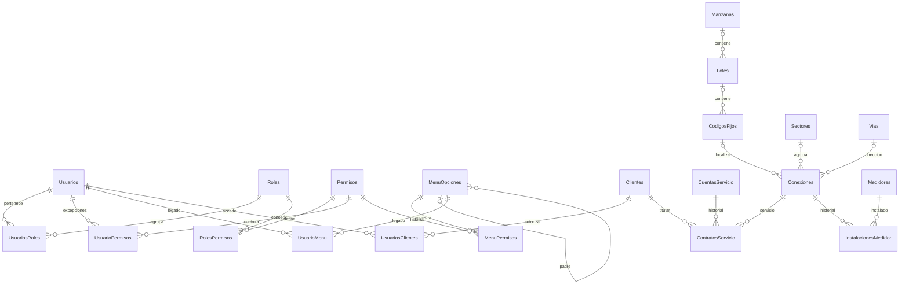
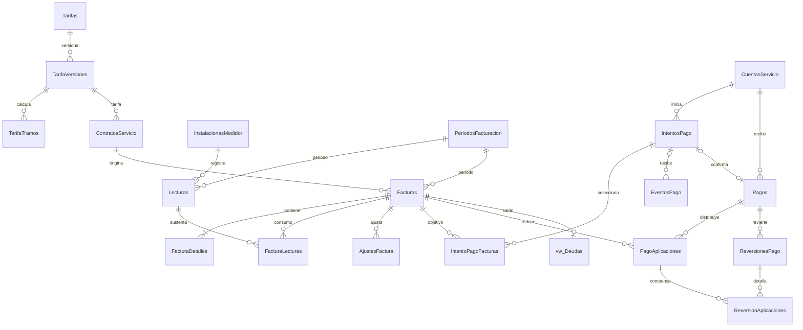
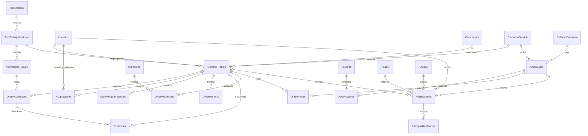
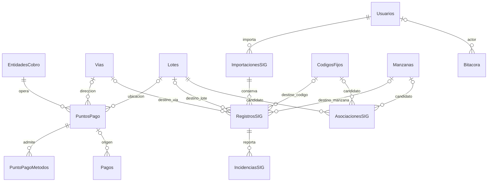
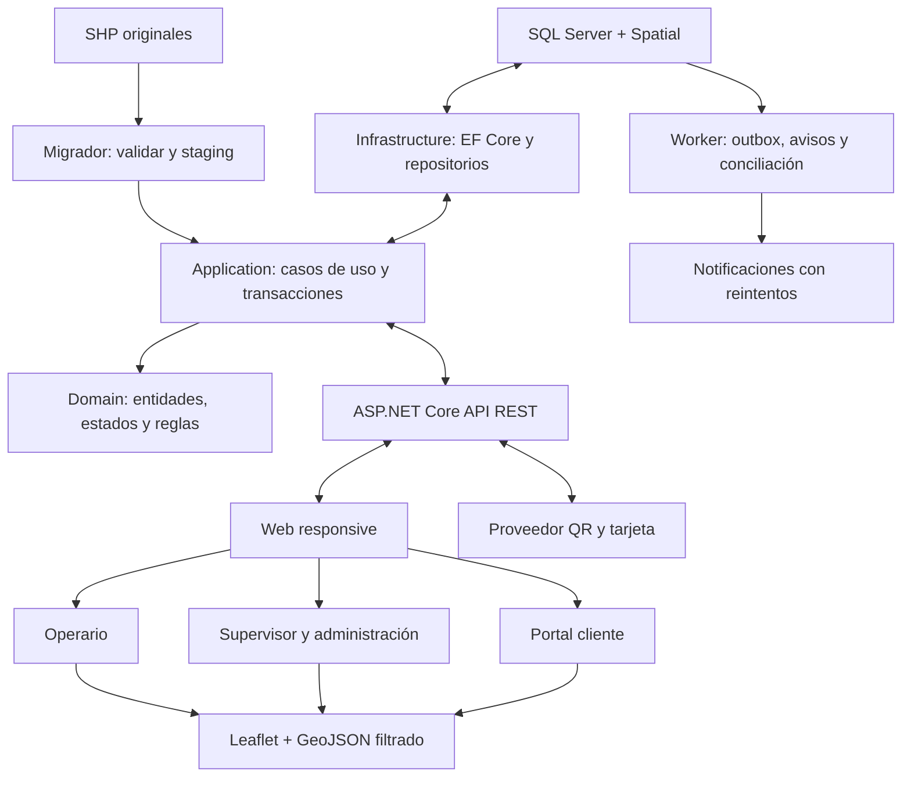

# AquaControl — análisis y modelo propuesto

Fecha: 14 de septiembre de 2026. Estado: propuesta para aprobación, sin DDL aplicado ni desarrollo iniciado.

## 1. Alcance y evidencia

Se leyeron los ocho archivos de ScriptDatabaseV13, las 22 páginas del PDF de especificaciones y los cuatro conjuntos SIG: SHP, SHX, DBF, PRJ, CPG y metadatos XML. Se revisaron visualmente los mockups del PDF. La inspección binaria recorrió los registros SHP/DBF y contrastó offsets y longitudes con SHX. No se encontraron archivos SBN/SBX en el inventario; no son necesarios para leer estos conjuntos.

**La base actual descrita aquí es la declarada por los scripts. No se ha conectado a una instancia SQL Server ni recibido un respaldo de la base instalada.** No se puede afirmar que el servidor tenga exactamente este esquema, estos usuarios o estos registros. La primera operación de la migración será contrastar el catálogo real, dependencias y conteos.

El PDF describe VisorDatosSIG y restringe modificaciones del diseño académico. Tu solicitud explícita amplía el alcance a AquaControl y autoriza adaptar el modelo; se toma como requisito rector para esta propuesta. Se conserva el migrador y los requisitos útiles del visor. No se asume que el cronograma académico de 45 días alcance para el nuevo sistema.

No hay código fuente de una aplicación en los archivos recibidos. Los enlaces .aspx de los menús no demuestran que esas pantallas existan o funcionen.

## 2. Base de datos actual

Nombre declarado: `VisorDatosSIG`. Los scripts definen **nueve tablas**, no nueve módulos operativos.

| Tabla | Campos actuales | Relaciones y restricciones relevantes |
|---|---|---|
| Usuarios | IdUsuario, Login, Nombre, PasswordHash, PasswordSalt, Iteraciones, Activo, FechaRegistro | PK IdUsuario; Login único |
| Roles | IdRol, NombreRol, Descripcion, Estado | PK IdRol; NombreRol único |
| UsuariosRoles | IdUsuarioRol, IdUsuario, IdRol | FK a Usuarios/Roles; par único |
| MenuOpciones | IdMenu, IdMenuPadre, Nivel, NombreMenu, Url, Icono, Orden, Estado | FK autorreferente; Nivel entre 1 y 3 |
| UsuarioMenu | IdUsuarioMenu, IdUsuario, IdMenu, PuedeVer, PuedeCrear, PuedeEditar, PuedeEliminar | FK a Usuarios/MenuOpciones; par único |
| CodigosFijos | IdCodigo, CodF_SQL, CodF_SIG, CodFijo, Nombre, Estado, FechaCambioEstado, IdLote, Longitud, Latitud, Geom | FK a Lotes; Estado entre 1 y 5; códigos sin unicidad |
| Manzanas | IdManzana, IdOrigen, UV_MZA, UV, MZA, Geom | PK IdManzana |
| Lotes | IdLote, IdOrigen, NroLote, IdManzana, Geom | FK a Manzanas |
| Vias | IdVia, OBJECTID, Nombre, TipoVia, OSMID, Geom | PK IdVia |

Objetos adicionales: `TR_CodigosFijos_FechaCambioEstado`, `sp_BuscarInmueble`, `sp_ActualizarLoteCodigosFijos`; cuatro índices espaciales y los índices de búsqueda declarados. No hay bitácora ni historial persistente de asignaciones, aunque existan menús con esos nombres.

Los scripts inicializan tres cuentas y cinco roles: Administrador, Catastro, Lecturador, Cortador y Reconexion. Son semillas de instalación; no se verificó que estén presentes en una base real. No se reproducen sus credenciales en este informe.

| Archivo | Hallazgo |
|---|---|
| 01_CrearBD.sql | Crea todo el esquema anterior. Solo la creación de BD está protegida; las tablas e inserciones no constituyen una migración repetible sobre una instalación existente. |
| 02_Importar_SHP.md | Da correspondencia por capa, pero no por todos los atributos; propone centroides para vincular lotes. Hace referencia a una carpeta de origen no incluida. |
| 03_Crear_Usuario.md | Documenta PBKDF2-SHA256 con 100.000 iteraciones y creación de cuenta mediante página temporal. Debe sustituirse por aprovisionamiento controlado. |
| 04_Actualizar_CodigosFijos_Estado.sql | Añade estados y fecha; redefine la búsqueda usando intersección espacial con TOP sin orden. |
| 05_Optimizar_Relacion_CodigoFijo_Lote.sql | Añade FK e índice, pero su procedimiento puede reemplazar IdLote por NULL; no redefine la búsqueda para recuperar el JOIN indexado de 01. |
| 06_Agregar_Nombre_Vias.sql | Añade Nombre si falta, pero no copia los nombres desde el DBF. |
| 07_Roles_Usuarios_Menu.sql | Reutiliza roles y usuarios; puede reactivar roles desactivados al repetirlo. |
| 08_MenuOpciones_UsuarioMenu.sql | Crea navegación y permisos por usuario; contiene rutas Web Forms y opciones sin URL. No crea tablas operativas. |

## 3. Perfilado de los datos SIG

| Capa | Registros SHP = DBF = SHX | Tipo SHP | Resultado estructural |
|---|---:|---|---|
| Exp_CodigoFijo_4326 | 6.271 | PointZ | Sin offsets SHX inconsistentes ni registros DBF marcados como borrados |
| Exp_MapaBase_LOTES_4326 | 15.281 | PolygonZ | Igual |
| Exp_MapaBase_MZA_4326 | 863 | PolygonZ | Igual; coincide con el conteo documentado |
| Exp_MapaBase_VIAS_4326 | 578 | PolyLine | Igual |

Los cuatro PRJ declaran WGS84 geográfico y los CPG UTF-8. Las extensiones SHP están en grados: aproximadamente longitudes -61,008 a -60,919 y latitudes -16,441 a -16,321. Esto respalda importar como SRID 4326, sin reproyectar otra vez estos archivos. Los XML contienen historia de procesamiento y, en algunos casos, extensiones antiguas incompatibles con el SHP actual: no deben prevalecer sobre la lectura del conjunto actual.

La validación realizada es estructural y de atributos, **no una certificación topológica**. Queda pendiente comprobar autointersecciones, anillos, solapes, contención entre capas y equivalencia con `STIsValid()` en SQL Server. Ninguna geometría ha sido reparada.

Hallazgos cuantitativos:

- `CodFijo`: 6.072 valores distintos; 189 grupos repetidos y 199 filas adicionales respecto de una fila por valor. Esto no demuestra que sean clientes duplicados.
- `CodF_SIG`: 6.080 valores distintos y 181 grupos repetidos. `Text` coincide con `CodF_SIG` en las 6.271 filas de este conjunto.
- En 6.265 puntos, `Longi/Latid` difieren de X/Y del SHP en más de 0,00001 grados en al menos un eje. `Latid` alcanza -61,003887, fuera de la extensión local de la capa aunque dentro del rango mundial de latitud. La causa concreta debe investigarse; no basta con validar rangos mundiales.
- El atributo `Id` de todos los lotes y todas las manzanas vale 0. No sirve como identificador de origen único.
- Manzanas: 317 `UV_MZA`, 492 `UV` y 327 `MZA` vacíos. Hay tres grupos repetidos no vacíos de `UV_MZA`.
- Vías: 376 registros sin nombre. `name` y `Nombre` coinciden en todas las filas, al igual que `osm_id` y `OSMID`. `osm_id` y `OBJECTID` son únicos en este archivo, no se garantiza su unicidad en exportaciones futuras.
- El DBF vial declara `name` con ancho 48; el SQL limita Nombre a 40. Los valores actuales llegan a 39 caracteres, pero futuras importaciones podrían exceder el destino.

### Correspondencia explícita propuesta

| Origen | Destino | Tratamiento |
|---|---|---|
| Código: CodF_SQL, CodF_SIG, CodFijo, Nombre | Campos equivalentes de CodigosFijos | Conservar, sin deduplicar ni crear clientes automáticamente |
| Código: Text | Atributos originales de importación | Conservar aunque coincida hoy con CodF_SIG |
| Código: Longi, Latid | Atributos originales de importación | No usarlos como coordenadas canónicas sin resolver discrepancias |
| Código: SHP PointZ | CodigosFijos.Geom | Conservar geometría y Z; GeoJSON operativo 2D derivado |
| Lotes: Id | Lotes.IdOrigen | Preservar 0 como dato de origen, nunca como clave de reimportación |
| Lotes: NroLote | Lotes.NroLote | Texto; no único global |
| Manzanas: Id, UV_MZA, UV, MZA | Campos equivalentes | Vacíos normalizados a NULL en destino, originales preservados |
| Vías: Nombre/name | Vias.Nombre | Preferir Nombre no vacío, luego name; detectar conflictos futuros |
| Vías: OSMID/osm_id, OBJECTID, type | Vias.OSMID, OBJECTID, TipoVia | Códigos externos preservados; type es la clasificación textual |
| Vías: ref, oneway, bridge, maxspeed, highway | Atributos originales de importación | No inventar semántica; conservar aunque no se usen en operación |
| Geometrías de lotes, manzanas y vías | Geom correspondiente | Validar tipo, coordenadas, SRID y topología antes de promover |

## 4. Problemas y cambios justificados

### 4.1 Coordenadas contradictorias

**PROBLEMA:** el buscador usa COALESCE sobre Latitud/Longitud y prioriza atributos inconsistentes frente a Geom.

**CAUSA:** representación duplicada sin validación; el origen exacto de las discrepancias no está probado.

**SOLUCIÓN:** adoptar la geometría validada como fuente cartográfica; conservar atributos originales y diferencias para revisión.

**CAMBIO EN BD:** trazabilidad de importación y coordenadas derivadas de Geom en consultas/vistas. Conservar temporalmente las columnas antiguas sin usarlas para geolocalización.

**IMPACTO:** evita mostrar puntos en ubicaciones erróneas; requiere comparar destino real antes de actualizar.

### 4.2 Identificadores insuficientes

**PROBLEMA:** Id=0 en polígonos y códigos repetidos en puntos impiden un upsert seguro por esos atributos.

**CAUSA:** identificadores heredados de exportación y códigos que no garantizan identidad de entidad.

**SOLUCIÓN:** mantener PK internas y asignar identidad de registro de origen por versión de archivo y ordinal; reconciliar entre versiones con correspondencias verificadas.

**CAMBIO EN BD:** ImportacionesSIG, RegistrosSIG e IncidenciasSIG; unicidad por importación/capa/ordinal, hash de archivo y mapa a PK destino.

**IMPACTO:** reintentar el mismo archivo no duplica filas; un archivo reordenado o editado no se considera automáticamente la misma entidad por su ordinal.

### 4.3 Asociación espacial destructiva o ambigua

**PROBLEMA:** el OUTER APPLY de 05 puede borrar IdLote si deja de encontrar intersección; TOP(1) oculta coincidencias múltiples. El centroide de 02 puede quedar fuera de un polígono cóncavo. 04 deja la búsqueda espacial aun después de ejecutar 05.

**CAUSA:** selección automática sin estado de revisión ni distinción entre relación manual y sugerida.

**SOLUCIÓN:** generar candidatos; asociar solo coincidencias inequívocas con geometrías válidas; enviar cero o múltiples coincidencias a revisión. No sobrescribir vínculos revisados. Punto interior es una ayuda, no prueba de contención total.

**CAMBIO EN BD:** registrar método, fecha y aprobación de asociación; revisar procedimientos y consultar las FK persistidas. Aplicar actualización por lote dentro de transacción explícita; XACT_ABORT por sí solo no agrupa instrucciones.

**IMPACTO:** preserva relaciones útiles y hace visible la ambigüedad. La reparación se aplicará después de aprobar el modelo.

### 4.4 Mezcla entre catastro y servicio

**PROBLEMA:** CodigosFijos mezcla nombre, estado del servicio y localización, pero no define cliente, contrato ni conexión física.

**CAUSA:** esquema pensado para un visor.

**SOLUCIÓN:** conservar el objeto SIG; separar cliente, cuenta de abonado, contrato y conexión. No inferir titularidad por nombre ni un contrato por punto.

**CAMBIO EN BD:** nuevas entidades comerciales y operativas. Estado físico en Conexiones; aviso y orden gestionan el corte. Estado legado se conserva para conciliación.

**IMPACTO:** soporta cambio de titular, varias conexiones y medidores históricos sin reasignar deudas a otra persona.

### 4.5 Seguridad ligada a navegación

**PROBLEMA:** CRUD por menú no expresa cobrar, asignar, verificar, gestionar datos propios o acceder solo a órdenes asignadas.

**CAUSA:** falta un catálogo de acciones y alcance por recurso.

**SOLUCIÓN:** permisos de negocio en servidor, reutilizando Usuarios, Roles y UsuariosRoles.

**CAMBIO EN BD:** Permisos, RolesPermisos y UsuarioPermisos para excepciones explícitas; MenuPermisos para visibilidad. Ampliar Usuarios con versión de credencial, bloqueo, sello de seguridad y cambio obligatorio de contraseña.

**IMPACTO:** migrar cada permiso existente con trazabilidad; casos sin equivalencia se revisan, sin otorgar permisos globales. Identity se integrará con las tablas existentes mediante almacenes/mapeo adaptado; no crear un segundo padrón de usuarios. Los hashes antiguos requieren verificador compatible y actualización al autenticarse o restablecimiento, no conversión directa.

### 4.6 Límites y pérdida de atributos

**PROBLEMA:** faltan controles de SRID/tipo, trazabilidad y preservación de varios atributos DBF; Nombre de vía tiene capacidad menor que el origen.

**CAUSA:** importación descrita por capa y no por columna.

**SOLUCIÓN:** mapeo completo, staging y validación antes de publicar.

**CAMBIO EN BD:** ampliar Vias.Nombre a NVARCHAR(120), conservar atributos crudos, añadir restricciones espaciales después de sanear y verificar datos. Revisar índices por consultas reales, incluyendo Lotes.IdManzana.

**IMPACTO:** evita truncamientos y pérdida silenciosa; no inventa nombres de calles faltantes.

## 5. Reutilización y posibles eliminaciones

**Se reutilizan las nueve tablas actuales. No se propone eliminar ninguna en la primera migración.**

| Tabla | Adaptación |
|---|---|
| Usuarios | Conservar IdUsuario y cuentas útiles; extender autenticación segura y normalización de login tras comprobar colisiones |
| Roles / UsuariosRoles | Añadir roles requeridos; conservar roles históricos como especialidades/permisos cuando corresponda |
| MenuOpciones | Añadir código estable único, rutas nuevas y control de ciclos/profundidad; conservar IDs |
| UsuarioMenu | Mantener en compatibilidad hasta trasladar todas las concesiones y denegaciones |
| CodigosFijos | Separar identidad comercial y estado de servicio; preservar códigos, geometría y estado legado |
| Lotes / Manzanas | Preservar PK y geometrías, incorporar procedencia y asociación revisada |
| Vias | Ampliar Nombre; mapear TipoVia y OSMID; conservar atributos originales |

**TABLA:** UsuarioMenu, candidata futura a retiro, no eliminación aprobada.

**MOTIVO PARA ELIMINAR:** una vez migrada su función, mantener dos autoridades de permisos permitiría divergencias.

**¿AFECTA OTRA TABLA?:** referencia Usuarios y MenuOpciones; puede ser consumida por software externo no entregado.

**SOLUCIÓN:** inventariar dependencias SQL y código, exportar correspondencia, probar equivalencia, mantener vista de compatibilidad y retirar solo cuando no haya consumidores. Sin esa evidencia se conserva.

CodF_SQL, CodF_SIG y CodFijo no se fusionan por semejanza. Nombre y Estado de CodigosFijos podrán retirarse del modelo operativo, pero permanecerán archivados y accesibles para trazabilidad. Roles antiguos no se borran ni se convierten automáticamente en privilegios administrativos.

## 6. Modelo final propuesto

Modelo lógico completo para aprobar. Las longitudes finales, nombres de restricciones y DDL se entregarán en la siguiente fase. Toda entidad tendrá PK; toda relación tendrá FK o una referencia técnica explícitamente validada. Se usarán importes DECIMAL, fechas operativas con zona/UTC definida y rowversion para concurrencia; nunca FLOAT para dinero. Borrado restrictivo para documentos, pagos y trabajo ejecutado.

### 6.1 Seguridad y padrón

| Entidad | Campos/relaciones esenciales |
|---|---|
| Permisos | IdPermiso, Codigo único, Descripcion, Activo |
| RolesPermisos | IdRol + IdPermiso únicos |
| UsuarioPermisos | IdUsuario + IdPermiso únicos, Efecto permitir/denegar, motivo; denegación explícita prevalece |
| MenuPermisos | IdMenu + IdPermiso, reglas de visibilidad; no autoriza la API |
| Clientes | IdCliente, tipo persona, documento/tipo/emisor opcionales, nombre, contacto, dirección, estado; no asumir documento único sin reglas de negocio |
| UsuariosClientes | IdUsuario, IdCliente, vigencia y autorización; permite portal de titulares o representantes sin duplicar clientes |
| CuentasServicio | IdCuenta, NumeroAbonado único como texto, fecha alta, estado comercial |
| Sectores | IdSector, Codigo único, nombre, geometría opcional |
| Conexiones | IdConexion, codigo interno único, IdCodigo opcional FK a CodigosFijos, IdSector, IdVia opcional, dirección, Geom, estado físico, fechas |
| ContratosServicio | IdContrato, IdCuenta, IdCliente titular, IdConexion, Desde, Hasta, IdTarifaVersion; historial de titularidad |
| Medidores | IdMedidor, NumeroSerie único, marca/modelo, diámetro, estado |
| InstalacionesMedidor | IdInstalacion, IdConexion, IdMedidor, Desde/Hasta, lectura inicial/final; historial de reemplazos |

Decisión: el número de abonado identifica la cuenta de servicio; un cliente puede ser titular de varias cuentas. Cambiar titular crea un contrato nuevo y no cambia las facturas anteriores. Un código SIG puede relacionarse con varias conexiones hasta resolver su semántica real. Cada conexión tiene como máximo un contrato vigente; cada cuenta, como máximo un contrato vigente en este alcance. Evitar intervalos superpuestos mediante validación transaccional, no solo con índices filtrados de filas abiertas. Cada conexión y medidor tendrá como máximo una instalación vigente de medición en el modelo inicial.

### 6.2 Consumo, facturación y pagos

| Entidad | Campos/relaciones esenciales |
|---|---|
| PeriodosFacturacion | IdPeriodo, inicio/fin, estado, código único |
| Lecturas | IdLectura, IdInstalacion, IdPeriodo, valor, fecha, capturador, estado, motivo de estimación/corrección |
| Tarifas / TarifaVersiones / TarifaTramos | Catálogo, vigencia, moneda, cargo fijo, rangos de consumo y precio; sin solapes de vigencia/rangos |
| Facturas | IdFactura, Numero único, IdContrato, IdPeriodo, emisión, vencimiento, moneda, total, estado; titular/dirección fiscal como instantánea |
| FacturaDetalles | IdDetalle, IdFactura, concepto, cantidad, precio, importe e instantánea de tarifa aplicada |
| FacturaLecturas | IdFactura + IdLectura, función anterior/actual; permite cambio de medidor dentro del período |
| AjustesFactura | IdAjuste, IdFactura, importe con signo, motivo, autorización, referencia; reversos, no edición del documento emitido |
| IntentosPago | IdIntento, IdCuenta, método QR/TARJETA, proveedor, referencia, importe/moneda, vencimiento, estado e idempotencia |
| IntentoPagoFacturas | IdIntento, IdFactura, importe objetivo; FK y validación de pertenencia |
| EventosPago | IdEvento, proveedor + identificador externo únicos, estado de procesamiento, fecha, huella del mensaje |
| Pagos | IdPago, IdCuenta, IdIntento opcional, referencia externa única por proveedor, método, importe/moneda, confirmadoEn, estado, IdPuntoPago opcional |
| PagoAplicaciones | IdAplicacion, IdPago, IdFactura, importe, fecha; distribuye un pago entre varias facturas |
| ReversionesPago | IdReversion, IdPago, referencia externa única, importe, motivo, estado |
| ReversionAplicaciones | IdReversion, IdAplicacion, importe; revierte exactamente las aplicaciones afectadas |
| vw_Deudas | Vista de saldo por factura/contrato/cuenta con total, ajustes, aplicaciones confirmadas y reversiones efectivas |

**No crear DEUDAS como tabla duplicada de FACTURAS.** El saldo es total emitido + ajustes firmados - aplicaciones + reversiones aplicadas. Deuda vencida es saldo positivo con vencimiento cumplido. Los saldos a favor permanecen como importe no aplicado del pago; no se pierden ni se fuerzan sobre otra cuenta. Una optimización futura materializada deberá ser reconstruible y conciliable.

Controles: pago y factura deben pertenecer a la misma cuenta y moneda; suma de aplicaciones no excede fondos disponibles; no sobrepagar una factura; reversión no supera lo efectivamente aplicado. Estas sumas entre filas requieren transacción y bloqueo/concurrencia, además de CHECK positivos por fila. Un intento o captura de pantalla no confirma un pago.

### 6.3 Trabajos, avisos y operación

| Entidad | Campos/relaciones esenciales |
|---|---|
| TiposTrabajo | IdTipo, Codigo único, nombre, activo, efecto operativo configurado: ninguno/corte/reconexión/instalación/cambio; el efecto no depende del texto del nombre |
| TipoTrabajoVersiones | IdVersion, IdTipo, número, vigencia; versiones publicadas inmutables |
| ActividadesTrabajo | IdActividadPlantilla, IdVersion, orden, descripción, obligatoria, requiere lectura/evidencia |
| OrdenesTrabajo | IdOrden, Numero único, IdVersion, IdContrato opcional, IdConexion opcional, IdSupervisor, prioridad, fechas creación/programación/inicio/fin, estado, ubicación, instrucciones, observaciones, rowversion |
| OrdenActividades | IdOrdenActividad, IdOrden, plantilla origen, texto/requisitos copiados, secuencia, estado, resultado, ejecutor y fecha |
| Asignaciones | IdAsignacion, IdOrden, IdOperario FK Usuarios, IdAsignador FK Usuarios, Desde/Hasta, motivo; historial de reasignaciones |
| OrdenProgramaciones | IdProgramacion, IdOrden, fecha anterior/nueva, autor, motivo |
| OrdenHistorial | IdHistorial, IdOrden, estado anterior/nuevo, actor, instante, motivo, versión |
| Evidencias | IdEvidencia, IdOrden, IdOrdenActividad opcional, autor, fecha, URI privada, hash, tipo, tamaño, coordenadas opcionales |
| Materiales | IdMaterial, Codigo único, nombre, unidad, activo |
| OrdenMateriales | IdConsumo, IdOrden, IdMaterial, cantidad positiva, costo unitario histórico, autor, fecha; correcciones trazables |
| AvisosCorte | IdAviso, IdContrato, emisión, vencimiento de aviso, corteProgramado, estado, versión de política y deuda al emitir |
| AvisoFacturas | IdAviso + IdFactura, saldo al emitir; facturas deben pertenecer al contrato avisado |
| OrdenAvisos | IdOrden + IdAviso; une orden de corte y sus causas, con control de una orden de corte activa por conexión |
| PoliticasCobranza | Versiones de umbral, antigüedad, plazos, gracia, regla de pago parcial y habilitación de corte |
| Notificaciones | IdNotificacion, IdUsuario destinatario, IdOrden/IdAviso/IdPago opcionales, mensaje, fecha, leídaEn |
| EntregasNotificacion | IdEntrega, IdNotificacion, canal, intentos, estado, próxima ejecución, entregadaEn |
| Outbox | IdEvento único, tipo, entidad, carga mínima, creación, estado; publicación fiable después del commit |

Supervisor y operario son usuarios con permisos; no son duplicados de Usuarios. Se permite una asignación operativa vigente por orden en el alcance inicial, preservando todas las anteriores. Órdenes de fuga o mantenimiento de área pueden carecer de cliente/conexión, pero deben tener ubicación e instrucciones. Para corte o reconexión, la conexión es obligatoria; el corte por deuda requiere aviso y contrato coherentes.

### 6.4 SIG, puntos de pago y auditoría

| Entidad | Campos/relaciones esenciales |
|---|---|
| EntidadesCobro | IdEntidad, nombre, tipo BANCO/COOPERATIVA/EMPRESA/AUTORIZADO |
| PuntosPago | IdPunto, IdEntidad, nombre, tipo de punto, dirección, horarios, contacto, Geom, IdVia/IdLote opcionales, activo |
| PuntoPagoMetodos | IdPunto + método; distingue información de disponibilidad e integración efectiva |
| ImportacionesSIG | IdImportacion, capa, archivo, SHA256, CRS, codificación, usuario, fecha, estado, conteos |
| RegistrosSIG | IdRegistro, IdImportacion, ordinal, atributos originales, geometría original, FK opcional específica a Codigo/Lote/Manzana/Via con exactamente un destino cuando fue promovido |
| IncidenciasSIG | IdIncidencia, IdRegistro, campo, motivo, propuesta, resolución y revisor |
| AsociacionesSIG | Candidatos código-lote o lote-manzana, método, confianza descriptiva, estado, autor; FK tipadas y CHECK del tipo de vínculo |
| Bitacora | IdEvento, actor, acción, entidad/identificador, correlación, fecha, cambios mínimos; sin secretos |

No crear una tabla genérica HISTORIAL que reemplace todas las relaciones: OrdenHistorial, ContratosServicio, InstalacionesMedidor y OrdenProgramaciones expresan cada historia; Bitacora registra acciones transversales. Las referencias genéricas de auditoría no se usarán como relaciones operativas.

## 7. Diagrama final por módulos

Los diagramas componen un único modelo; las entidades repetidas son las mismas tablas. Las relaciones opcionales y restricciones temporales se detallan en la sección 6.

## 8. Máquina de estados y flujo deuda-corte-pago

| Estado | Destinos permitidos | Condiciones |
|---|---|---|
| PENDIENTE | ASIGNADA, REPROGRAMADA, CANCELADA | Asignar requiere operario activo y autorizado |
| ASIGNADA | EN_CAMINO, REPROGRAMADA, CANCELADA | Solo asignado inicia desplazamiento |
| EN_CAMINO | EN_EJECUCION, NO_REALIZADA, REPROGRAMADA, CANCELADA | Revalidar saldo y autorización para cortar |
| EN_EJECUCION | FINALIZADA, NO_REALIZADA, CANCELADA | Finalizar exige actividades/evidencias; cancelar solo si no ocurrió efecto físico |
| FINALIZADA | VERIFICADA, EN_EJECUCION | Supervisor verifica o devuelve con observaciones; un corte realizado no se repite al devolver |
| VERIFICADA | CERRADA | Supervisor cierra |
| NO_REALIZADA | REPROGRAMADA, CANCELADA | Motivo obligatorio; reprogramación supervisada |
| REPROGRAMADA | PENDIENTE, ASIGNADA, CANCELADA | Nueva fecha, historial y asignación vigente coherente |
| CANCELADA / CERRADA | Ninguno | Estados terminales; correcciones mediante nuevo trámite vinculado |

Reasignar no es un estado: cierra Asignaciones anterior y crea otra; una orden EN_EJECUCION necesita entrega formal o declaración NO_REALIZADA antes de reasignar. Todas las transiciones se validan en un servicio de dominio, con rowversion y transacción. El tipo configurable no puede conceder transiciones arbitrarias.

Flujo de cobranza:

1. Calcular deuda vencida de contrato/cuenta desde documentos y pagos confirmados.
2. Aplicar política versionada, generar aviso con facturas y saldo al emitir, registrar entrega y fecha de corte.
3. Supervisor crea orden por conexión, asigna operario y actividades de la versión publicada.
4. Antes de iniciar y justo antes de ejecutar el corte, consultar saldo y vigencia de la autorización en servidor.
5. El proveedor confirma pago mediante evento autenticado; validar identificador, importe, moneda, cuenta y estado. Procesar idempotentemente.
6. En una transacción: registrar pago, aplicar importes, reevaluar todos los avisos/cortes afectados, cancelar órdenes no ejecutadas que hayan perdido causa y escribir historial, bitácora y outbox.
7. Tras el commit, notificar a supervisor y operario; reintentar entregas sin duplicar pago ni transición. El portal muestra el saldo persistido.

**Concurrencia crítica:** pago y autorización de corte deben serializarse por conexión/cuenta con el mismo protocolo de bloqueo, revalidación y versión. Una notificación por sí sola no detiene un trabajo. El operario deberá confirmar en línea antes del acto físico y actualizar su estado inmediatamente; no autorizar cortes offline. La base no puede hacer atómico un cobro digital con una acción física humana: un pago que llega después de la última validación requiere aviso urgente y procedimiento operativo de detención.

Si el servicio ya fue cortado, el pago no borra la ejecución ni transforma la orden en CANCELADA: genera revisión/reconexión según política. Un pago parcial solo cancela el corte si elimina su causa conforme a la regla configurada. Una reversión posterior reabre saldo y evaluación de cobranza; no resucita una orden cancelada. No se atribuyen deudas antiguas automáticamente a un nuevo titular.

## 9. Permisos por rol

| Rol | Alcance |
|---|---|
| SUPER ADMIN | Seguridad, configuración global y auditoría; no puede saltarse integridad financiera ni estados |
| ADMINISTRADOR | Padrón, facturación, puntos de pago, catálogos y reportes según permisos; ajustes/reversiones con autorización específica |
| SUPERVISOR | Crear, asignar, reprogramar, cancelar y verificar órdenes dentro de su ámbito |
| OPERARIO | Ver órdenes asignadas, localización e instrucciones; registrar ejecución, materiales y evidencias; no verificar su propio trabajo |
| CLIENTE | Solo datos de clientes/cuentas autorizados en UsuariosClientes, facturas, deuda, pagos, avisos y puntos de pago |

Catastro, Lecturador, Cortador y Reconexion se preservan como perfiles especializados si tienen usuarios/consumidores. No se otorga SUPER ADMIN a toda cuenta Administrador existente. El mapa del cliente no expone nombres, deudas ni ubicación de otros abonados.

## 10. Plan de migración sin pérdida de información

1. **Inventario real:** identificar instancia/BD, versión, tablas, columnas, PK/FK, índices, vistas, procedimientos, triggers, permisos, trabajos SQL y aplicaciones consumidoras. Comparar con los ocho archivos; registrar diferencias. No ejecutar 01 sobre producción.
2. **Respaldo verificable:** copia completa SQL y log según modelo de recuperación, scripts de objetos/permisos, copia inmutable de todos los componentes SIG y SHA256. Restaurar en una BD de ensayo y verificar consistencia. El respaldo no se considera probado hasta restaurarlo.
3. **Perfilado en ensayo:** conteos, huérfanos, códigos repetidos, coordenadas divergentes, topología y relaciones espaciales. Registrar excepciones por fila. Contrastar SHP con SQL, sin dar por hecho que la BD solo contiene los archivos recibidos.
4. **Expansión aditiva:** conservar VisorDatosSIG y sus IDs; añadir tablas/columnas propuestas, inicialmente opcionales donde haga falta. Separar DDL de semillas y permisos. Cada migración tendrá versión, checksum, precondiciones, transacción apropiada y reporte.
5. **Staging SIG:** cargar originales con mapeo explícito y procedencia; impedir duplicados del mismo lote de importación. Para datos existentes sin procedencia, reconciliar en ensayo; no truncar/reinsertar tablas referenciadas. Las incidencias preservan datos rechazados sin promoverlos como válidos.
6. **Conciliación comercial:** crear clientes/cuentas/conexiones únicamente desde registros confiables o revisión autorizada. El nombre del punto no prueba identidad. No crear facturas, medidores, deudas, pagos o correos ficticios a partir de cartografía. Los datos de prueba estarán en una BD separada y claramente identificados.
7. **Seguridad:** migrar permisos y rutas con matriz de equivalencias; mantener restricciones y excepciones; bloquear o restablecer cuentas de instalación no aptas. Preservar IDs, actualizar hashes mediante flujo compatible. No usar la página temporal de 03.
8. **Validar y endurecer:** PK/FK confiables, checks espaciales, índices, uniques legítimos, no solapes de vigencia y conciliación financiera. Filas pendientes permanecen en staging o en estado de revisión, sin borrarlas para hacer pasar restricciones.
9. **Ensayo funcional:** pruebas del flujo completo de corte/pago, permisos por objeto, reemplazo de medidor, cambio de titular, importación repetida, recuperación y rendimiento SIG.
10. **Corte de versión:** ventana controlada, detener escritores antiguos, respaldo final y captura de cambios; migrar, conciliar conteos y saldos, cambiar aplicación y monitorear. Evitar dos aplicaciones escribiendo estados incompatibles.
11. **Retiro diferido:** solo después de período de observación y prueba de ausencia de dependencias, retirar columnas/vistas/tablas obsoletas conforme a una migración separada.

**Rollback:** antes de nuevas operaciones, revertir despliegue y restaurar BD ensayada, o aplicar reversión aditiva que no quite datos útiles. Después de recibir pagos o trabajos nuevos, no restaurar ciegamente un respaldo antiguo: suspender escrituras, preservar eventos y operaciones posteriores, conciliar con proveedor y aplicar corrección hacia adelante o replay controlado. Nunca eliminar documentos nuevos como mecanismo de rollback. Las migraciones que cambien valores conservarán antes/después y correspondencias de PK.

Criterios de aprobación de la migración: ningún original perdido; cada fila destino o incidencia trazable; conteos conciliados; saldos iguales antes/después; FK sin huérfanos; no truncamientos; restricciones verificadas; restauración probada. La estructura definitiva se contrasta con la instancia antes de aplicar cambios.

## 11. Arquitectura del software

Propuesta: monolito modular ASP.NET Core, C#, EF Core, SQL Server Spatial, API REST y web Razor/HTML/CSS/JavaScript con Bootstrap y Leaflet. Portal de cliente con rutas, navegación y autorización propias; supervisor y operario comparten servicios de negocio. No se necesitan microservicios para este alcance inicial.

Dependencias de compilación: Domain no depende de otros proyectos; Application depende de Domain; Infrastructure implementa interfaces de Application; API compone servicios; Web consume contratos/API; Migrador reutiliza Application/Infrastructure; Tests valida las capas. Las flechas del diagrama representan flujo, no referencias entre proyectos.

La configuración espacial de EF Core debe mapear explícitamente `geometry`, preservando el tipo actual; las consultas derivan GeoJSON sin modificar originales. Referencia: [Microsoft — datos espaciales en EF Core para SQL Server](https://learn.microsoft.com/en-us/ef/core/providers/sql-server/spatial).

Cada endpoint verificará permiso y pertenencia del recurso, además del rol. Referencia: [Microsoft — autorización por recurso en ASP.NET Core](https://learn.microsoft.com/en-us/aspnet/core/security/authorization/resource-based?view=aspnetcore-10.0).

El mapa cargará por bbox, zoom y límites; polígonos simplificados solo en respuesta, nunca sobre la fuente. La posición del cliente se obtiene de sus conexiones; no se crea una geometría personal redundante. Métricas de distancia/área requerirán cálculo geodésico o proyección apropiada, no tratar grados como metros. No se expondrán todas las geometrías y datos personales a cualquier rol.

QR y tarjeta usarán un adaptador de proveedor, checkout alojado/tokenización y eventos autenticados. AquaControl no almacenará PAN/CVV. Un QR generado sin integración no se presentará como pago funcional. Proveedor, credenciales y cuentas de cobro son dependencias reales pendientes; se usarán entornos sandbox explícitos durante pruebas.

## 12. Configuraciones y decisiones pendientes

| Decisión | Propuesta / necesidad |
|---|---|
| Identidad de abonado | NumeroAbonado en CuentasServicio; confirmar relación real con CodFijo antes de conciliación |
| Titularidad | Contrato temporal; deuda permanece en el contrato facturado |
| Cobranza | Configurar plazos, umbrales, pago parcial, gracia y reconexión; no habilitar cortes automáticos sin valores aprobados |
| Tarifas | Versiones por vigencia, cargo fijo, tramos, redondeo, estimaciones y tratamiento de cambio de medidor |
| Facturación fiscal | Definir documentos y requisitos aplicables antes de afirmar validez fiscal; no se realiza dictamen legal en este análisis |
| Pagos | Seleccionar proveedor QR/tarjeta, moneda, credenciales de pruebas/producción, conciliación y reversos |
| Operación | Una asignación vigente por orden; confirmar si se requieren cuadrillas antes del DDL |
| Notificaciones | Portal persistente desde el inicio; correo/SMS dependen de canal y datos autorizados |
| Despliegue | Confirmar SQL Server disponible, dominio, certificados, almacenamiento de evidencias y políticas de respaldo |

Estas decisiones no impiden presentar el modelo; sí condicionan activar cobros/cortes reales y cerrar el diseño físico correspondiente.

## 13. Entregas por fases y pruebas

Se respetará el orden solicitado: análisis → diseño físico → migraciones → seguridad → padrón/medidores → facturación/pagos → tipos/actividades → órdenes/asignaciones → supervisor → operario → portal → avisos → SIG → puntos de pago → reportes/auditoría → pruebas finales. La instrumentación y las pruebas se incorporan desde cada módulo, aunque la validación integral sea la fase 16. En facturación se construye el contrato de pago; la cancelación de corte se completa al existir órdenes/avisos, con prueba integral posterior.

Cada fase entregará código ejecutable, migraciones versionadas, instrucciones de configuración, prueba funcional y límites pendientes. Antes de ello, se requiere tu aprobación de esta estructura conforme a tu instrucción de no comenzar a programar.

Pruebas críticas previstas:

- Pago repetido/concurrente: un solo pago y una sola aplicación efectiva; moneda o importe incorrectos no confirman deuda.
- Pago parcial, completo, reversión y saldo a favor; sumas consistentes y sin aplicaciones entre cuentas distintas.
- Pago simultáneo con corte: revalidación, cancelación solo antes del efecto físico y ruta de reconexión posterior.
- Estados terminales no reabiertos; finalización sin evidencias obligatorias rechazada; verificación solo por supervisor autorizado.
- Cambio de titular no mueve deuda anterior; cambio de medidor conserva lecturas e instalación histórica.
- Cliente no puede acceder a otra cuenta ni mediante URL directa, GeoJSON, evidencia o identificador de pago.
- Importación repetida no duplica; fallo crítico revierte; atributos originales y Z siguen preservados.
- Asociación espacial ambigua no pisa relación manual; coordenadas de consulta derivadas de geometría validada.
- Outbox se recupera después de caída y no pierde notificaciones; conciliación recupera eventos del proveedor no recibidos.
- Restauración en entorno limpio, pruebas contra SQL Server real, móvil a 360 px y consultas SIG acotadas.

**Resultado de esta etapa:** base existente aprovechable, nueve tablas conservadas, problemas documentados, modelo lógico propuesto y migración planificada. No se ha cambiado la BD ni generado código del producto.
